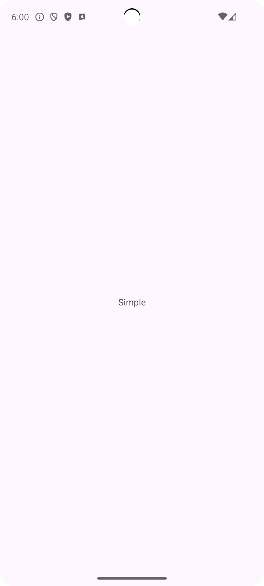
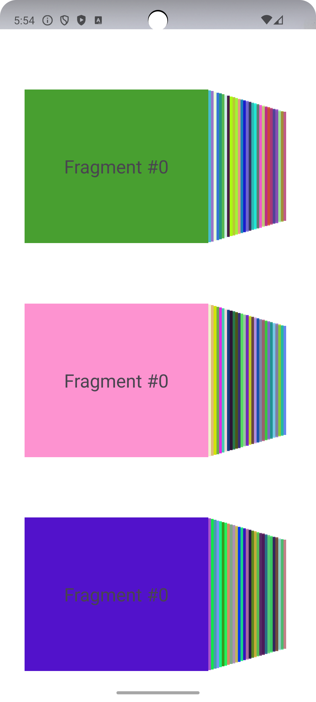
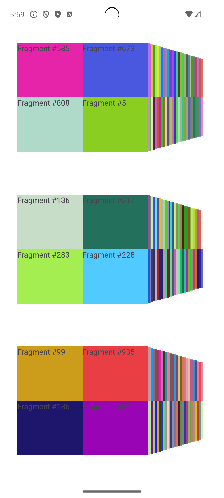
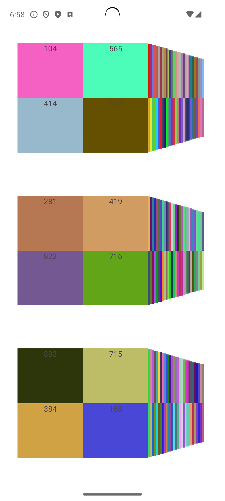

# Benchmark Tests for Android Application Startup

Этот проект включает в себя набор тестов для измерения времени запуска различных активностей в Android приложении `com.ato.fragmentscheck`. Бенчмарк тесты написаны с использованием библиотеки [Macrobenchmark](https://developer.android.com/studio/profile/macrobenchmark).

## Описание Тестов

В файле `ExampleStartupBenchmark.kt` реализованы четыре теста для измерения времени холодного запуска различных активностей:

3. **3x30x4 Activity** (`Activity3x30x4`):
   - Проверяет время запуска активности с тремя view pager, в каждом из которых 30 фрагментов и в каждом фрагменте еще 4 фрагмента
   - итого 360 фрагментов.
4. **3x30x4 No Fragments Activity** (`Activity3x30x4NoFragments`):
   - Проверяет время запуска активности с тремя view pager, в каждом из которых 30 фрагментов, и внутри которых 4 textview.
   - итого 90 фрагментов.
   - позволяет в сравнении с Activity3x30x4 понять, как повлияет уменьшение 360 -> 90 фрагментов на перформанс.

## Результаты Замеров

Результаты замеров представлены в таблице ниже, где для каждой активности приведено минимальное, медианное и максимальное время запуска по пяти итерациям:

| Activity                     | min (ms) | median (ms) | max (ms) | Скриншот                                  |
|------------------------------|----------|-------------|----------|-------------------------------------------|
| Simple Activity   - Проверяет время запуска простой активности.             | 877.5    | 929.8       | 968.3    |  |
| 3x30 Activity   - Проверяет время запуска активности с тремя view pager, в каждом из которых 30 фрагментов   - итого 90 фрагментов              | 1,324.1  | 1,353.1     | 1,698.4  |  |
| 3x30x4 Activity   Проверяет время запуска активности с тремя view pager, в каждом из которых 30 фрагментов и в каждом фрагменте еще 4 фрагмента   итого 360 фрагментов             | 1,734.6  | 1,751.4     | 2,164.0  |  |
| 3x30x4 No Fragments Activity   Проверяет время запуска активности с тремя view pager, в каждом из которых 30 фрагментов, и внутри которых 4 textview   итого 90 фрагменто   позволяет в сравнении с Activity3x30x4 понять, как повлияет уменьшение 360 -> 90 фрагментов на перформанс | 1,823.1  | 1,859.1     | 2,528.7  |  |

## Скриншоты

Ниже можно насладиться экранами соответствующих активностей:

### Simple Activity

### 3x30 Activity

### 3x30x4 Activity

### 3x30x4 No Fragments Activity

## Заключение

Эти бенчмарк тесты показывают, что отказ от фрагментов ухудшает перформанс. Разница составляет около 100 мс при уменьшении количества фрагментов с 360 до 90.
