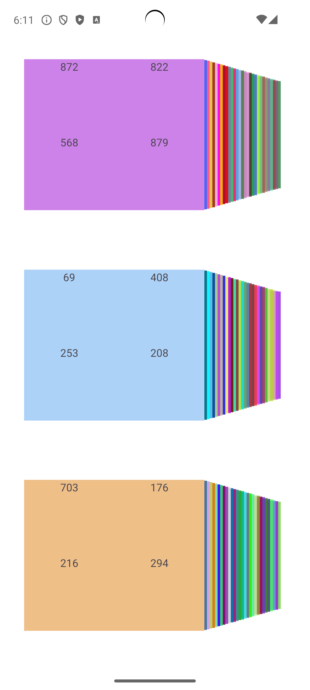

# Benchmark Tests for Android Application Startup

Этот проект включает в себя набор тестов для измерения времени запуска различных активностей в Android приложении `com.ato.fragmentscheck`. Бенчмарк тесты написаны с использованием библиотеки [Macrobenchmark](https://developer.android.com/studio/profile/macrobenchmark).

## Описание Тестов

В файле `ExampleStartupBenchmark.kt` реализованы четыре теста для измерения времени холодного запуска различных активностей:

1. **Simple Activity** (`SimpleActivity`):
    - Проверяет время запуска простой активности.
2. **3x30 Activity** (`Activity3x30`):
    - Проверяет время запуска активности с тремя view pager, в каждом из которых 30 фрагментов 
    - итого 90 фрагментов
3. **3x30x4 Activity** (`Activity3x30x4`):
    - Проверяет время запуска активности с тремя view pager, в каждом из которых 30 фрагментов и в каждом фрагменте еще 4 фрагмента
    - итого 360 фрагментов
4. **3x30x4 No Fragments Activity** (`Activity3x30x4NoFragments`):
    - Проверяет время запуска активности с тремя view pager, в каждом из которых 30 фрагментов, и внутри которых 4 textview. 
    - итого 90 фрагментов
    - позволяет в сравнении с Activity3x30x4 понять как повлияет уменьшение 360->90 фрагментов на перформанс

## Результаты Замеров

Результаты замеров представлены в таблице ниже, где для каждой активности приведено минимальное, медианное и максимальное время запуска по пяти итерациям:

| Activity                     | min (ms) | median (ms) | max (ms) | Скриншот                                          |
|------------------------------|----------|-------------|----------|---------------------------------------------------|
| Simple Activity              | 840.6    | 877.5       | 978.8    |               |
| 3x30 Activity                | 1,289.1  | 1,306.5     | 1,422.3  |                 |
| 3x30x4 Activity              | 1,658.8  | 1,717.9     | 1,942.9  |               |
| 3x30x4 No Fragments Activity | 1,761.6  | 1,801.0     | 1,875.9  |  |

## Скриншоты

Ниже приведены скриншоты соответствующих активностей:

### Simple Activity

### 3x30 Activity

### 3x30x4 Activity

### 3x30x4 No Fragments Activity

## Заключение

Эти бенчмарк тесты показывают что отказ от фрагментов не влияет на перформанс 
*разница в 100мс при уменьшении 360->90 фрагментов*